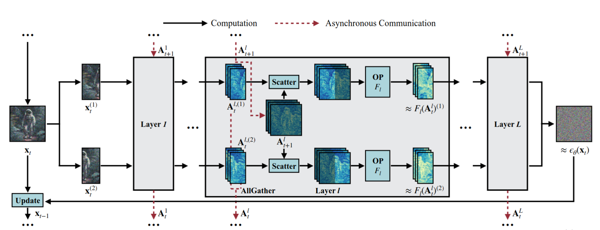

# BasedXL: Accelerated Stable Diffusion XL with Patch Parallelism

BasedXL is a demo project that showcases an implementation of Patch Parallelism from the [DistriFusion paper](https://arxiv.org/abs/2402.19481) to speed up multi-GPU performance of Stable Diffusion XL with minimal quality degradation. This project is intended to be run locally and is not a full library.

## Features

- Implements Patch Parallelism for accelerated multi-GPU inference
- Employs techniques from [stable-fast](https://github.com/chengzeyi/stable-fast) and [TensorRT](https://github.com/NVIDIA/TensorRT) for additional speedup
- Minimal dependencies and no build step


## Installation

To run this demo locally, ensure that you have PyTorch, Diffusers, and Fire (for CLI) installed. You can install the dependencies using the following command:

```bash
pip install torch diffusers fire
```

## Usage Example

### Basic usage

```bash
# Multi-GPU
torchrun --nproc-per-node=2 sample.py

# Single GPU
python sample.py
```

### Compile
Optionally compile the UNet with torch.compile for a slight speedup. (warning: can take minute or two)
```bash
torchrun --nproc-per-node=2 sample.py --compile_unet
```


## DistriFusion

DistriFusion is a method that enables the generation of high-resolution images using diffusion models by leveraging parallelism across multiple GPUs. The approach splits the model input into patches, assigns each patch to a GPU, and utilizes the similarity between adjacent diffusion steps to provide context for the current step, allowing for asynchronous communication and pipelining. Experiments demonstrate that DistriFusion can be applied to Stable Diffusion XL without quality degradation, achieving up to a 6.1× speedup on eight NVIDIA A100s compared to a single GPU.



## Acknowledgements

This project builds on the following works:
- DistriFusion: Distributing Diffusion Models with Patch Parallelism ([arXiv](https://arxiv.org/abs/2402.19481), [code](https://github.com/mit-han-lab/distrifuser))
- The Hugging Face Diffusers library ([code](https://github.com/huggingface/diffusers))
- Stable Fast ([code](https://github.com/chengzeyi/stable-fast))
- Nvidia's TensorRT inference SDK ([code](https://developer.nvidia.com/tensorrt))

## License

This project is released under the [MIT License](LICENSE).